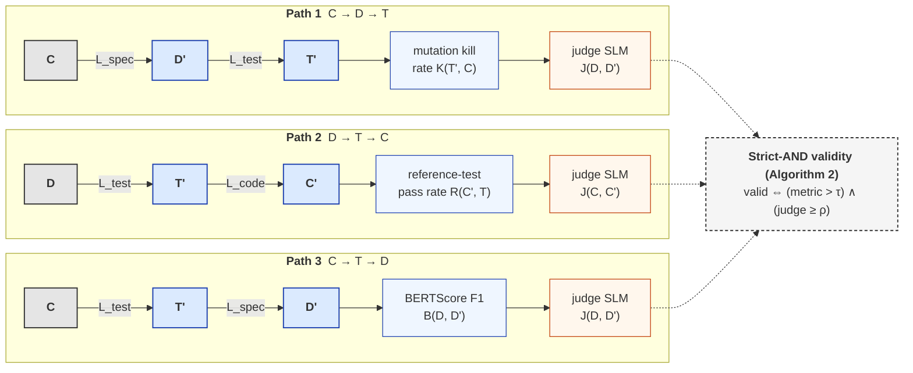

# roundtrip-closure

**Heterogeneous Multi-SLM Closure of the Docstring–Test–Code Triangle: A Mutation-Testing Study**

Chapter 3 of the PhD thesis:

> **Small Language Models for Software Engineering: Retrieval-Augmented Documentation, Mutation-Tested Generation, and Heterogeneous Round-Trip Closure**

Companion to:

- Chapter 1 — Docstring generation (under review at Springer-Nature *Automated Software Engineering*)
- Chapter 2 — Unit-test generation evaluated by mutation kill rate (under review at Springer-Nature *Software Quality Journal*)

## What this experiment measures

For each function `f` in HumanEval + MBPP, we traverse the
docstring–test–code triangle via one of three **closure paths**, each
composed of two SLM stages. The closure decision combines an
SE-validated automated metric with an external judge SLM's semantic
rating under a strict-AND policy.



The central question: **does closure rate improve when each stage is
owned by a different SLM (heterogeneous configuration) compared to
the same SLM filling all three stages (mono configuration)?**

## Model lineup (all Small Language Models, all <30B parameters)

| Slot | Ollama tag | Family | Size | Generation |
|---|---|---|---|---|
| Small floor | `llama3.2:3b` | Meta | 3 B dense | Oct 2024 |
| Mid-dense reasoning | `phi4:14b` | Microsoft | 14 B dense | Dec 2024 |
| Latest dense general | `qwen3.6:27b` | Alibaba | 27 B dense | Apr 2026 |
| Latest MoE | `gemma4:26b` | Google | 26 B MoE | Mar 2026 |
| Latest Mistral | `mistral-small3.2:24b` | Mistral | 24 B dense | 2025 |
| Coder specialist | `qwen3-coder:30b` | Alibaba (coder) | 30 B MoE | 2025 |
| **Judge** | `deepseek-r1:14b` | DeepSeek | 14 B dense | 2025 |

Five distinct model families in the pipeline; DeepSeek as the
external judge for closure-validity checks.

## Quick start (once filled in)

```bash
# 0. install
pip install -e .

# 1. one-time setup — pull models, download datasets, build index
ollama pull llama3.2:3b
ollama pull phi4:14b
ollama pull qwen3.6:27b
ollama pull gemma4:26b
ollama pull mistral-small3.2:24b
ollama pull qwen3-coder:30b
ollama pull deepseek-r1:14b

python prepare_roundtrip.py

# 2. run one cell of the DOE (edit CELL_ID in train_roundtrip.py first)
python train_roundtrip.py > logs/cell_M3.log 2>&1

# 3. run the 30-function pilot (6 cells, ~14 GPU-hours on A100)
python scripts/run_pilot.py
```

## Project layout

```
roundtrip-closure/
├── README.md                ← this file
├── concept_note.md          ← signed-off Chapter 3 design doc
├── pyproject.toml           ← deps + project metadata
├── .env.example             ← API-key template (not currently needed)
├── .gitignore
│
├── config.py                ← model lineup + per-cell config
├── doe.py                   ← 20-cell pre-registered DOE table
├── train_roundtrip.py       ← main experiment driver
├── prepare_roundtrip.py     ← one-time dataset prep
│
├── ollama_client.py         ← Ollama wrapper with retry + rate limiting
├── closure_cache.py         ← SHA-256 keyed disk cache for LLM calls
├── pytest_cache.py          ← SHA-256 keyed disk cache for pytest subprocess results
├── closure_paths.py         ← Path-1/2/3 traversal drivers
├── closure_metrics.py       ← kill rate / pass rate / BERTScore (BERTScore cached)
├── judge_llm.py             ← DeepSeek-R1 equivalence judge
├── decontaminate.py         ← HumanEval-Mutated transform (AST + LLM), resumable
├── mutation_testing.py      ← Chapter-2 carryover; run_tests_against_code wrapped with pytest_cache
│
├── scripts/
│   └── run_pilot.py         ← driver for the 30-function pilot
├── tests/
│   └── test_smoke.py        ← end-to-end smoke test (1 function)
│
├── data/                    ← datasets (gitignored)
├── checkpoints/             ← cache + intermediate artifacts
├── results/                 ← per-cell TSV outputs
└── logs/                    ← per-cell run logs
```

## Status (2026-06-04)

**Phase:** Implementation complete (Batches 1–5). Ready for Colab pilot.

| Component | Status |
|---|---|
| Project structure | ✓ scaffold + complete implementations |
| `config.py`, `doe.py` | ✓ live — 7-SLM lineup, 20-cell DOE |
| `ollama_client.py` | ✓ live + Ollama v0.4 Pydantic verified |
| `closure_cache.py` | ✓ live, fsync-durable; 1407× cache-hit speedup measured |
| `pytest_cache.py` | ✓ live — caches per-mutant pytest subprocess results |
| `closure_metrics.py` | ✓ live, BERTScore cached |
| `judge_llm.py` | ✓ live — DeepSeek-R1 rubric judge with parser |
| `closure_paths.py` | ✓ live — 3 closure paths, Path-1 verified on real Ollama |
| `decontaminate.py` | ✓ live — incremental JSONL writes, resumable |
| `prepare_roundtrip.py` | ✓ live — HumanEval + MBPP + LCB + HEM build |
| `train_roundtrip.py` | ✓ live — 3-layer resume strategy (cache + TSV + fsync) |
| `scripts/run_pilot.py` | ✓ live — 6 go/no-go checks |
| `colab_pilot.ipynb` | ✓ live — Drive-symlinked persistent storage |
| Pilot run | ⏳ ready — open `colab_pilot.ipynb` in Colab Pro+ A100 |
| Full sweep | ⏳ after pilot GO verdict |

## Checkpointing topology (5 layers; nothing is recomputed twice)

| Layer | What it caches | Storage | Survives Colab disconnect? |
|---|---|---|---|
| 1 | Every LLM call (model × role × prompt × params) | `checkpoints/cache/` | ✓ via Drive symlink |
| 2 | Every pytest subprocess (test × code × timeout) | `checkpoints/pytest_cache/` | ✓ |
| 3 | BERTScore F1 per docstring pair | `checkpoints/cache/` (same store, judge-role key) | ✓ |
| 4 | TSV resume — per `(cell, sample, path)` tuple | `results/results_roundtrip.tsv` | ✓ |
| 5 | Decontamination — per-problem JSONL append | `data/humaneval_mutated_50.jsonl` + `.rejected.jsonl` | ✓ |

All writes use atomic `.tmp → os.replace` and explicit `flush + fsync` to defend against Drive FUSE write-back lag.

## License

MIT — replication package for the PhD thesis.
